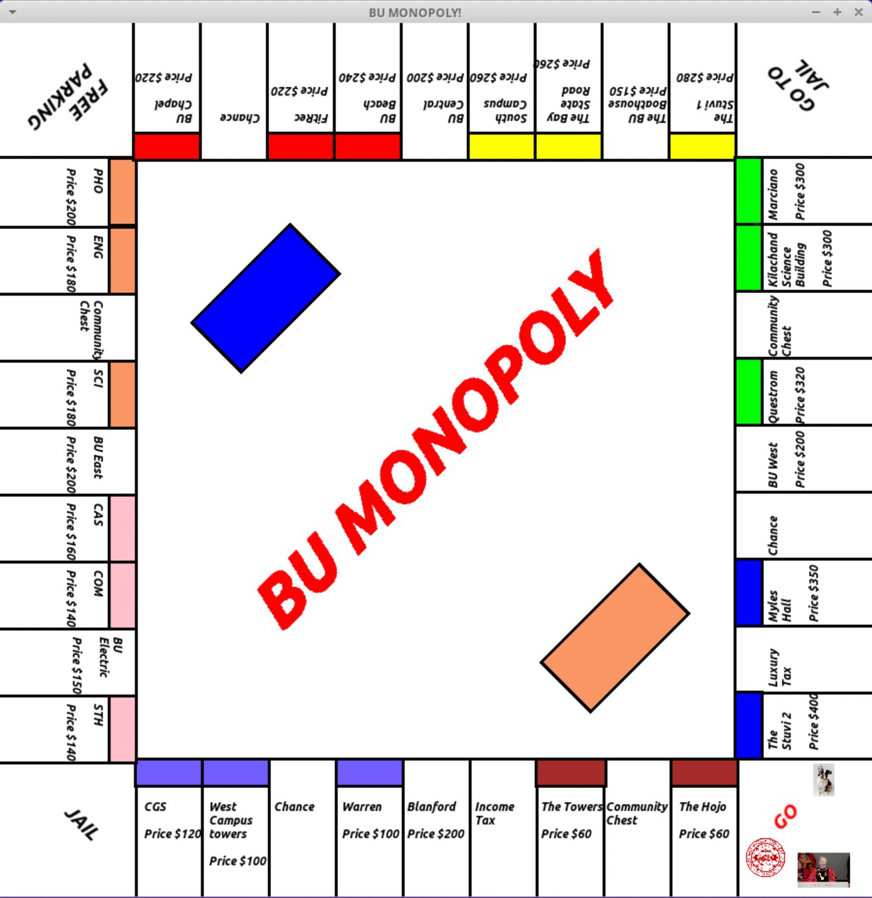

# BU Monopoly

## Table of contents
* [Introduction](#Introduction)
* [Technologies](#technologies)
* [Launch](#launch)
* [Illustration](#illustration)
* [Examples of Use](#examples-of-use)
* [Project Status](#project-status)
* [Contributors](#contributors)

## Introduction
We have programmed as close a replica to a functioning game of monopoly as possible. Of course, we made it BU themed, with even the chance and community chest cards containing humor regarding the school and BU students. We wanted to challenge ourselves with the idea of tying code together and then creating a software we could use to play games with each other.

## Technologies
* C++ 11
* SFML Library

## Launch
This project requires a linux machine with several libraries downloaded including the most important, SFML Library. All libraries needed are listed within each file necessary to run the program.

Once all the files are downloaded, you must run your terminal from within the directory that contains these files. Once there, type "make" to create all the executable files. Then, you can start the game by typing "mono" in the terminal and voila! You will have begun playing BU Monopoly!

```
$ make
$ mono
```

## Illustration
This is what the board looks like when the game is running.


## Features
* Playable between 2-4 people
* Dice Roll

## Examples of use
After executing "mono"...
To initialize number of players: Type a number from 2-4.
To roll the dice: Type "r" and hit enter.
When prompted... 
To buy a property: type "1" and hit enter. Otherwise: type "0" and hit enter.

##Project status
The project is not finished entirely but mostly operational. We are still missing...
//////
//////
//////

##Contributors
Jovany Vazquez
Christopher Lemus
Zachary Capone
